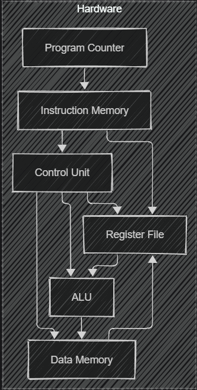
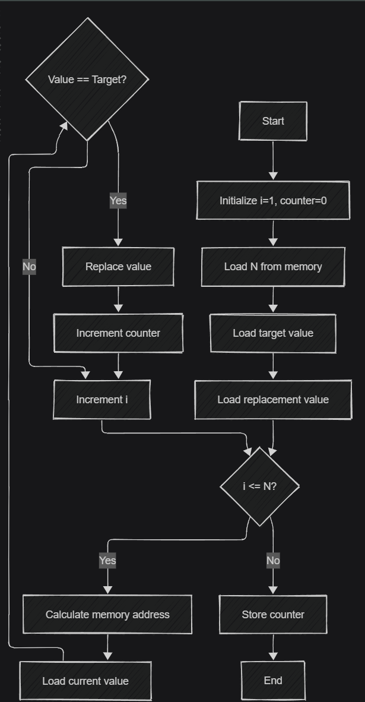

# RISC-V Search and Replace Implementation

A complete single-cycle RISC-V processor implementation designed to perform a memory search-and-replace algorithm. This project demonstrates the use of fundamental RISC-V instructions to perform memory operations, conditional branching, and arithmetic operations.

## Overview

This project implements a search-and-replace algorithm on a custom RISC-V processor architecture. The program scans through an array of 100 elements stored in memory, identifies all occurrences of a specific target value (0x14), replaces them with a designated replacement value (0xFEEDFEED), and maintains a count of all replacements made.

## Architecture

### Hardware Architecture


The diagram above shows the core hardware components of our RISC-V processor implementation and their interconnections. The implementation follows the classic single-cycle RISC-V architecture with:
- Program Counter driving instruction fetch
- Control Unit decoding instructions and generating control signals
- Register File storing operands and results
- ALU performing arithmetic and logical operations
- Data Memory storing the array and program data

### Memory Layout
- Address 0: Number of elements in the array (N = 100)
- Addresses 1-100: The array of numbers to be searched
- Address 101: Target value to search for (0x00000014)
- Address 102: Replacement value (0xFEEDFEED)
- Address 103: Result counter for tracking replacements made

### Register Allocation
- x5: Loop index (i)
- x6: Replacement counter
- x7: Number of elements (N)
- x8: Target value
- x9: Replacement value
- x10: Current value from memory
- x11: Memory address for current element

### Processor Components
The implementation consists of the following key components:

1. **Single Cycle Top**: Top-level module that connects all components
2. **Single Cycle Core**: Coordinates operation between datapath and control
3. **Core Datapath**: Creates paths for data to flow between registers, memory, and ALU
4. **Control Unit**: Decodes instructions and generates control signals
5. **Main Decoder**: Converts opcodes to primary control signals
6. **ALU Decoder**: Determines specific ALU operations
7. **ALU**: Performs arithmetic and logical operations
8. **Register File**: Stores and retrieves frequently used data
9. **Instruction Memory**: Stores program instructions
10. **Data Memory**: Stores the array data and results

## Algorithm Workflow



The flowchart above illustrates the complete workflow of our search-and-replace algorithm:

1. Initialize loop index (i) starting at 1 and counter at 0
2. Load the number of elements (N) from memory address 0
3. Load target value from memory address 101
4. Load replacement value from memory address 102
5. For each element from index 1 to N:
   - Calculate memory address for the current element
   - Load the current value from memory
   - Compare with target value
   - If matching, replace with replacement value and increment counter
   - Increment loop index regardless of match
6. Store the final counter value at memory address 103
7. End program execution

## Implementation Files

### Verilog Modules
- `Single_Cycle_Top.v`: Top-level module connecting all components
- `Single_Cycle_Core.v`: Core processor implementation
- `Core_Datapath.v`: Datapath implementation
- `Control_Unit.v`: Control logic implementation
- `Main_Decoder.v`: Instruction decoder
- `ALU_decoder.v`: ALU control logic
- `ALU.v`: Arithmetic Logic Unit implementation
- `Register_File.v`: Register file implementation
- `Instruction_Memory.v`: Instruction memory module
- `Data_Memory.v`: Data memory module
- `Extend.v`: Sign extension module
- `PC.v`: Program counter module
- `PC_Plus_4.v`: PC increment module
- `PC_Target.v`: Branch target calculator
- `PC_Mux.v`: PC multiplexer
- `ALU_Mux.v`: ALU input multiplexer
- `Result_Mux.v`: Result multiplexer

### Supporting Files
- `input_numbers.txt`: Input data for memory initialization
- `testbench.v`: Comprehensive testbench for verification

### Documentation
- `hardware_architecture.png`: Visual representation of the processor's hardware components
- `algorithm_workflow.png`: Flowchart showing the search-and-replace algorithm execution

## RISC-V Assembly Implementation

```assembly
// Initialize index and counter
ADDI x5, x0, 1   // Initialize i = 1 (start from first element)
ADDI x6, x0, 0   // Initialize counter = 0

// Load number of elements from address 0
LW x7, 0(x0)     // Load N from memory[0]

// Load target value from address 101
ADDI x11, x0, 101  // Set address to 101
SLL x11, x11, 2    // Multiply by 4 for word alignment (101*4=404)
LW x8, 0(x11)      // Load target value from memory[101]

// Load replacement value from address 102
ADDI x11, x0, 102  // Set address to 102
SLL x11, x11, 2    // Multiply by 4 for word alignment (102*4=408)
LW x9, 0(x11)      // Load replacement value from memory[102]

// Main loop start
LOOP:
// Check if we've processed all elements
BGE x5, x7, DONE   // If i > N, exit loop

// Calculate memory address for array[i]
SLL x11, x5, 2     // x11 = i * 4 (word alignment)

// Load current value from memory
LW x10, 0(x11)     // Load value at memory[i]

// Compare with target value
BNE x10, x8, NEXT  // If not equal to target, skip to next

// Replace the value and increment counter
SW x9, 0(x11)      // Store replacement at memory[i]
ADDI x6, x6, 1     // counter++

NEXT:
// Move to next element
ADDI x5, x5, 1     // i++
JAL x0, LOOP       // Jump back to start of loop

DONE:
// Store the replacement count at address 103
ADDI x11, x0, 103  // Set address to 103
SLL x11, x11, 2    // Multiply by 4 for word alignment (103*4=412)
SW x6, 0(x11)      // Store counter at memory[103]

// Program complete - infinite loop or halt
JAL x0, DONE       // Infinite loop to halt
```

## Setup and Simulation

### Requirements
- Icarus Verilog (iverilog) - Version 11.0 or newer recommended
- VVP simulation runtime
- GTKWave (optional, for viewing waveforms)

### Compilation and Simulation
Use the following commands to compile and simulate the design:

```bash
# Clone the repository
git clone https://github.com/yourusername/riscv-search-replace.git
cd riscv-search-replace

# Compile the design
iverilog -o riscv_sim test/testbench.v src/*.v

# Run the simulation
vvp riscv_sim

# View waveforms (optional)
# gtkwave waveform.vcd
```

You can also use the included compile script:

```bash
./compile.sh
```

## Results and Verification

After execution, the memory contents will show:
1. All occurrences of the target value 0x14 replaced with 0xFEEDFEED
2. The counter at address 103 showing the number of replacements made (7)
3. All other memory values remaining unchanged

## Performance Analysis

### Execution Metrics
- **Instruction Count**: 21 instructions total (5 initialization, 11 in main loop, 5 finalization)
- **Execution Time**: ~1110 cycles for 100 elements (5 + 11*100 + 5)
- **Memory Usage**: ~500 bytes total (84 bytes instructions, 416 bytes data)

### Hardware Utilization
The single-cycle implementation prioritizes simplicity over performance, with each instruction taking exactly one clock cycle to execute. This design choice provides predictable timing but doesn't optimize for throughput.

### Performance Bottlenecks
The main performance bottleneck in this implementation is the memory access pattern, with each iteration of the search loop requiring multiple memory operations. Advanced implementations could leverage caching or pipelining to improve throughput.

## Future Improvements

1. Pipeline implementation to improve performance
2. Dynamic configuration for array size and target/replacement values
3. Extended functionality for searching multiple different target values
4. Advanced memory addressing schemes
5. Enhanced error handling for edge cases

## Contributors
- Himanshi Namdev (B23491)
- Thamanna A Majeed (B23301)
- Siddhant Tyagi (B22278)
- Saatvik Mangal (B22232)
- Vulli Sharanya (B23506)
- Somya Bhadada (B23052)
- Om Maheshwari (B23089) - Group Lead

## References
1. RISC-V International, "The RISC-V Instruction Set Manual"
2. Patterson and Hennessy, "Computer Organization and Design RISC-V Edition"
3. Harris and Harris, "Digital Design and Computer Architecture: RISC-V Edition"
4. Waterman and Asanović, "The RISC-V Instruction Set Manual, Volume I: User-Level ISA"
5. Weste and Harris, "CMOS VLSI Design: A Circuits and Systems Perspective"
